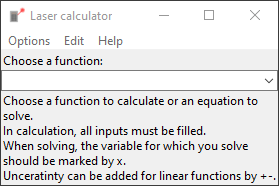
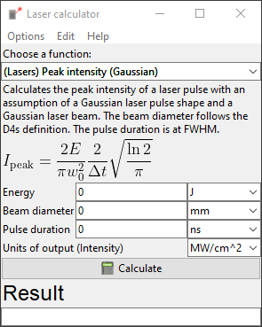
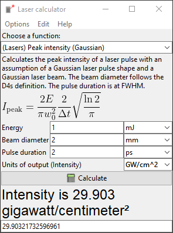
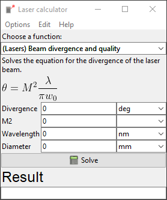
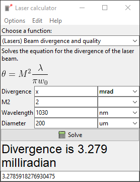
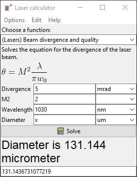
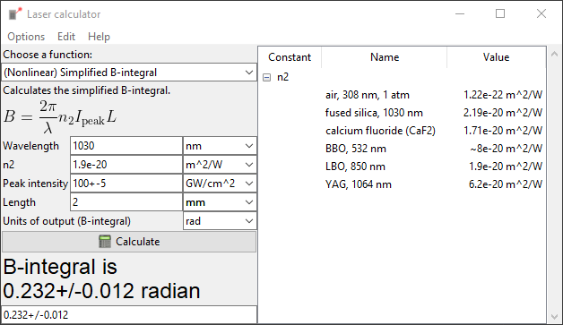
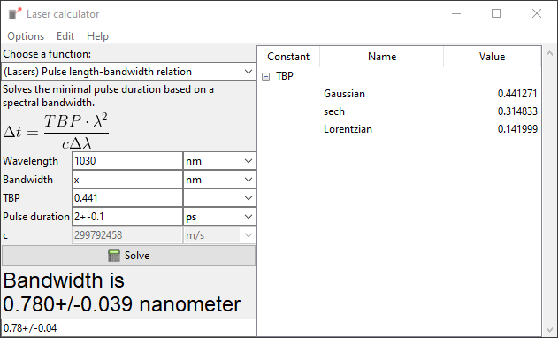

# 🌠 Laser and optics calculator

This is a simple calculator, which quickly allows one to calculate various functions and solve equations common in the optics and laser community. The two main things I have focused on are:

1. **Units** - all the calculations are working with the physical units that can be chosen by the users.
2. **Extendibility** - it is relatively simple to add a new function, change the available one, add allowed units and so on.

Additionally, when the calculated or solved function is _linear_, one can add an uncertainty to the values, which will be propagated into the results.

Nice online calculators, that can do similar stuff, are these:

- [Optics toolbox](http://toolbox.lightcon.com) from Light conversion
- [Laser calculator](https://lasercalculator.com) by Joona Rissanen

In contrast to those, however, you can quickly and simply add anything you need to this one 👍.

---

## Table of contents

- [🌠 Laser and optics calculator](#-laser-and-optics-calculator)
  - [Table of contents](#table-of-contents)
  - [Application usage](#application-usage)
    - [List of available function](#list-of-available-function)
    - [Starting the application](#starting-the-application)
    - [Basic overview](#basic-overview)
      - [Calculate regime](#calculate-regime)
      - [Solve equation regime](#solve-equation-regime)
    - [Using uncertainties](#using-uncertainties)
    - [Constants in the function](#constants-in-the-function)
    - [History](#history)
    - [Displaying help](#displaying-help)
    - [Check for updates](#check-for-updates)
    - [Starting from `.bat` file with conda](#starting-from-bat-file-with-conda)
  - [Adding new functions](#adding-new-functions)
    - [Structure of the `functions.json` file](#structure-of-the-functionsjson-file)
    - [Structure of the `constants.json` file](#structure-of-the-constantsjson-file)
  - [Local development](#local-development)
    - [Setting up conda environment](#setting-up-conda-environment)
    - [Packages](#packages)
    - [Building and distribution](#building-and-distribution)
    - [Updating README](#updating-readme)

---

## Application usage

### List of available function

- Gratings:
  - Diffraction anlge (solve)
  - GDD of a grating pair (solve)
  - TOD of a grating pair (solve)
- Lasers:
  - Average power-energy-frequency relation (solve)
  - Beam divergence and quality (solve)
  - Peak fluence (calc)
  - Peak intensity (calc)
  - Peak power-energy-duration relation (solve)
  - Pulse length-bandwidth relation (solve)
- Nonlinear:
  - Critical power for self-focusing (calc)
  - Simplified B-integral (calc)
- Optics:
  - Brewster's angle
  - Snell's law (calc)
  - Spot size after lens (calc)
  - Wavelength matching (solve)
  - Frequency-wavelength conversion (solve)

New functions can be easily added by following the section [Adding new functions](#adding-new-functions).

### Starting the application

To start the application by running `laser-calculator.py`, you need to have python installed and following packages have to be available: `numpy`, `pint`, `uncertainties` and `sympy`. In case you are using conda package manager, you can set up the environment [like this](#setting-up-conda-environment) and then start the program [like this](#starting-from-bat-file-with-conda).

### Basic overview

After the application is started, following window appears:



There is a dropdown menu, from which you can choose a function to calculate or an equation to solve. Short instructions of use are added below the dropdown menu.

After the selction of one of the functions, the program will rearange itself accordingly. First, let's take a look on the laser peak intensity calculation as an example of the _calculate regime_.

#### Calculate regime

After the selection of the desired function, window similar to the following one will appear:



The _calculate regime_ can be recognized by the `Calculate` button and by the possibility to choose the units of the output variable.

After the input variables are filled and the units chosen, you can click the `Calculate` button to obtain the result in your chosen units. The program will look like this:



In the label with a big font, the result is shown with the units. Below is an entry, from which you can simply copy the result as a number.

#### Solve equation regime

Sligthly different is the _solve regime_, as there is no predetermined output. You have to choose the desired output variable by writing `x` instead of its value. For example, let's take a look at beam divergence calculation:



One can for example want to calculate the beam divergence from the beam quality and beam waist diameter at a particular wavelength. Or one can measure the beam divergence and then find out, how small is the beam diameter in waist. Both of these can be calculated like on the following pictures:




### Using uncertainties

If you have a measured quantity with an uncertainty, you can add this error after the magnitude by using `+-` like on the following picture:


This works only for linear function (meaning no `sin` and similar):

- GDD of a grating pair (not working for θ)
- TOD of a grating pair (not working for θ)
- Average power-energy-frequency relation
- Beam divergence and quality
- Peak fluence
- Peak intensity
- Peak power-energy-duration relation
- Pulse length-bandwidth relation
- Frequency-wavelength conversion
- Critical power for self-focusing (but it doesn't really make sense here)
- Simplified B-integral
- Spot size
- Wavelength matching

### Constants in the function

If there are some constants associated with the functions, they will be displayed in a list on the right part of the program, like this:



These constants can be easily changed or added, the process in described [in this section](#structure-of-the-constantsjson-file).

### History

History of calculations can be shown by clicking on the `Options` menu and then `Show history` button.


Alternatively, one can use `Ctrl+H` shortcut. The history will be shown in separate window with four columns, showing the date and time of calculation, the name of the function, inputs and outputs, as is demonstrated on the following picture:


The history is saved in the `history.json` file and can be cleared by deleting the file or by clicking the `Clear history` button in the `Options` menu.

### Displaying help


If you need help, you can display the `.html` version of this README file by pressing `F1` key or navigating to the `Help` menu and clicking on `Show readme` item.

You can also visit the project page (this one) with clicking on the `Show on GitHub` item in the `Help` menu.

### Check for updates

You can check for updates from the last item in the `Help` menu. This will check your version from the current version in the main branch of the project GitHub repository, and if the versions are different, you can be redirected to the webpage to download the new version manually.

### Starting from `.bat` file with conda

If you have conda installed and use the appropriate conda environment, and you would like to quickly start the program just by double-clicking some icon, you can create a `.bat` file in the notepad for example. In this file, something similar to the follwong command should be written:

```bat
Call C:\Users\user.name\Anaconda3\Scripts\activate.bat & conda activate laser-calculator & cd "C:\Users\user.name\Documents\Python\laser-calculator" & python "C:\Users\user.name\Documents\Python\laser-calculator\laser-calculator.py"
pause
```

Of course, you have to change the `user.name` and the file locations. This will first activate conda in the open command prompt, next it will activate the respective python environment. Afterwards, it will change the working directory to the folder, where the program is saved, and finally, it will start the program. You can of course use any other method. For this to work, you theoretically don't need to have python and conda added in your system path.

---

## Adding new functions

New function can be added to the `functions.json` file. The program offers the option to directly open and edit the `functions.json` file in the default editor by selecting the `"(Re)define functions"` from the `"Edit"` menu. The structure of the file is described [below](#structure-of-the-functionsjson-file). All the function equations are evaluated by the python script with the use of `eval` or `exec`, which can make some mess, if you write something else than the intended function there. The program is not very strict in controlling what does it evaluate, since we are all consenting adults.

Each function can have an assigned equation saved as a `png` figure, which is displayed in the program. The equations are generated by webpage https://latex.codecogs.com/legacy/eqneditor/editor.php, downloaded in png format and saved in the `formulas` folder with the same name, as is the name of the function definition.

If you want me to add a new function, you can open an issue. Preferably, attach also the formula, description and other parts yourself. You can of course fork the repository and eventually open a pull request.

### Structure of the `functions.json` file

How does the definition of one sample function look like in the `functions.json` file is shown below.

```json
"duration-bandwidth" : {
        "name" : "(Lasers) Pulse length-bandwidth",
        "regime" : "calc",
        "description" : "Calculates the minimal pulse duration based on a spectral bandwidth.",
        "function" : "I[2]*I[0]**2/(I[1]*299792458*self.ureg('m/s'))",
        "inputs": {
            "Wavelength" : {
                "position" : 0,
                "units" : [
                    "um",
                    "nm"
                ]
            },
            "Bandwidth" : {
                "position" : 1,
                "units" : [
                    "um",
                    "nm"
                ]
            },
            "TBP" : {
                "position" : 2,
                "units" : [
                ]
            }
        },
        "outputs" : {
            "name" : "Pulse duration",
            "units" : [
                "ns",
                "ps",
                "fs"
            ]
        },
        "constants" : [
            "TBP"
        ]
    },
```

The `functions.json` file consists of a dictionary of definitions similar to the one above. The key of the particular dictionary item (in this case `"duration-bandwidth"`) is the name of the definition, used also as a filename for the `png` equation. The value of this dictionary is the function definition, which is a dictionary in itself, with the following keys:

- `"name"` is the name shown in the program. Should be short and descriptive and can also contain a category for quick orientation.
- `"regime"` can be either `"calc"` or `"solve"`. First, I will describe the `"calc"` regime and then, I will shown the differences for the `"solve"` regime.
- `"description"` is the extended description also shown in the program.
- `"function"` is the function to be evaluated. Each of the variables is represented by `I[ind]`, where `ind` is defined in the `"inputs"`. If there is a constant with a unit, as in the example above, the unit can be added by multiplying the magnitude with `ureg('unit')`. The function represents the right side of the particular equation, if the left side is the desired output.
- `"inputs"` is a dictionary of input variables, each defined by a key (name shown in the program) and values of `"position"` (starting from zero and corresponding to the index `ind` in the function definition) and a list of allowed units.
- `"outputs"` defines a name and allowed units for the result of the calculation.
- `"constants"` - if there are some constants in the calculation (like the _time-bandwidth product_ in the example above), it can be written in the optional key `"constants"`. Multiple constants can be added. The respective values for the constants have to be added to the `constants.json`, which is described in [the next section](#structure-of-the-constantsjson-file).

If the regime of the calculation is `"solve"`, following changes take place:

- `"function"` definition is now an equation in the form of `"sympy.Eq(` + left-hand side + `,` + right-hand side + `)"`.
- `"variables"` - all variables used in the function definition are listed under the `"variables"` keys, and `"inputs"` and `"output"` keys are missing. Every variable has an associated name, position (corresponding to the index `ind`) and units. If there is some constant with units in the equation, it can be added as an additional variable with it's value filled in, as is done in the following example (the last variable, speed of light).

```json
        "function" : "sympy.Eq(I[3],I[2]*I[0]**2/(I[1]*I[4]))",
        "variables": {
            "a" : {
                "name" : "Wavelength",
                "position" : 0,
                "units" : [
                    "um",
                    "nm"
                ]
            },
            "b" : {
                "name" : "Bandwidth",
                "position" : 1,
                "units" : [
                    "um",
                    "nm"
                ]
            },
            "c" : {
                "name" : "TBP",
                "position" : 2,
                "units" : [
                ]
            },
            "d" : {
                "name" : "Pulse duration",
                "position" : 3,
                "units" : [
                    "ns",
                    "ps",
                    "fs"
                ]
            },
            "e" : {
                "name" : "c",
                "position" : 2,
                "units" : [
                    "m/s"
                ],
                "value" : 299792458
            }
        },
```

In the program, this last variable will be shown, but it will be in `readonly` or `disabled` state, like it is shown in the next figure:



### Structure of the `constants.json` file

The program also offers the option to directly open and edit the `constants.json` file in the default editor by selecting the `"(Re)define constants"` from the `"Edit"` menu.
Currently, the `constants.json` file looks like this:

```json
{
  "n2": {
    "air, 308 nm, 1 atm": "1.22e-22 m^2/W",
    "fused silica, 1030 nm": "2.19e-20 m^2/W",
    "calcium fluoride (CaF2)": "1.71e-20 m^2/W",
    "BBO, 532 nm": "~8e-20 m^2/W",
    "LBO, 850 nm": "1.9e-20 m^2/W",
    "YAG, 1064 nm": "6.2e-20 m^2/W"
  },
  "TBP": {
    "Gaussian": "0.441271",
    "sech": "0.314833",
    "Lorentzian": "0.141999"
  }
}
```

It is a dictionary of constants defined by the keys (names, referenced in the definition of the functions) and values, which can take any form following the `"name" : "value"` convention and will be displayed in the program, when the associated functions are chosen.

---

## Local development

The GUI and the calculation part is writen in Python. Version 3.8.10 was used for the development.

The instructions below presume you have cloned this git repository you are in a command line
(`bash`, `cmd` etc.) in the root directory of this project.

### Setting up conda environment

For the first time, create a new `laser-calculator` conda environment with necessary packages using

```
conda env create -f environment.yaml
```

This environment must be updated when the `environment.yaml` file changes using

```
conda env update -f environment.yaml
```

Every time you are working on the project, activate the environment using

```
conda activate laser-calculator
```

### Packages

If you are not using conda, below is the list of packages you need in order to start the program (version added for completness):

- numpy=1.21
- pint=0.17
- uncertainties=3.1
- sympy=1.8

### Building and distribution

You can build the application using `cx_Freeze` package and running `python setup.py build` and `python setup.py bdist_msi`.

### Updating README

If you update this file, you should also update the `.html` version of the file with the use of `pandoc`. It is made simple by running the `make_html_pandoc.bat` file.